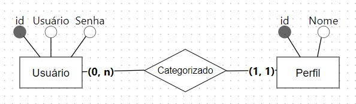

# Aula Sql-Alchemy

1. Criar um novo projeto com a seguinte estrutura:
   
    ````
   projeto
     |-- app.py
     |-- main.py
     |-- models.py
     |-- views.py
   ````

2. Instalar a biblioteca Flask-SQLAlchemy

   Site Flask-SQLAlchemy: [https://flask-sqlalchemy.palletsprojects.com/]()

   Site SQLAlchemy: [https://docs.sqlalchemy.org/]()

    ````
    pip install Flask-SQLAlchemy
    ````

3. Inicializar o objeto principal do Flask e do SQLAlchemy no arquivo `app.py`

    ````python
    from flask import Flask
    from flask_sqlalchemy import SQLAlchemy
    
    app = Flask(__name__)
    app.config['SQLALCHEMY_DATABASE_URI'] = "sqlite:///usuarios.db"
    
    db = SQLAlchemy(app)
   ````

4. Banco de Dados

   

5. Definindo as classes que representam as entidades do modelo em `models.py`
   
   ````python
   from app import db
   
   class Perfil(db.Model):
       __tablename__ = 'perfil'
   
       id = db.Column(db.Integer, primary_key=True)
       nome = db.Column(db.String(50), unique=True)
   
       def __repr__(self):
           return f"Papel: {self.nome}"
   
   class Usuario(db.Model):
       __tablename__ = 'usuario'
   
       id = db.Column(db.Integer, primary_key=True)
       usuario = db.Column(db.String(20), unique=True, index=True)
       senha = db.Column(db.String(20))
   
       def __repr__(self):
           return f"Usuário: {self.usuario}"
   ````

   ## **Tipos mais comuns de colunas do SQLAlchemy**:
   
   | Tipo         | Tipo Python          | Descrição                                                                    |   
   |--------------|----------------------| ---------------------------------------------------------------------------- |
   | Integer      | `int`                | Números inteiros, de até 32 bits                                             |
   | SmallInteger | `int`                | Inteiros de até 16 bits                                                      |
   | BigInteger   | `int` ou `long`      | Inteiros de maior precisão                                                   |
   | Float        | `float`              | Números reais em ponto flutuante                                             |
   | Numeric      | `decimal.Decimal`    | Números reais em ponto fixo                                                  |
   | String       | `str`                | String de tamanho variável                                                   |
   | Text         | `str`                | String de tamanho variável, otimizado para textos grandes                    |
   | Unicode      | `unicode`            | String de tamanho variável em formato Unicode                                |
   | UnicodeText  | `unicode`            | String de tamanho variável em formato Unicode, otimizado para textos grandes |
   | Boolean      | `bool`               | Valor Booleano                                                               |
   | Date         | `datetime.date`      | Data                                                                         |
   | Time         | `datetime.time`      | Tempo                                                                        |
   | DateTime     | `datetime.datetime`  | Data e Tempo                                                                 |
   | Interval     | `datetime.timedelta` | Intervalo de Tempo                                                           |
   | Enum         | `str`                | Lista de Strings                                                             |
   | PickleType   | Any Python object    | Serialização de Objetos Pickle automática                                    |
   | LargeBinary  | `str`                | Blob Binário                                                                 |

   ## **Opções utilizadas em Colunas**
   
   | Opção         | Descrição                                                                                             |
   |---------------|------------------------------------------------------------------------------------------------------ |
   | `primary_key` | Se for Verdadeiro, transforma a coluna na chave primária da tabela                                    |
   | `unique`      | Se Verdadeiro, não permite valores duplicados nesta coluna                                            |                                      
   | `index`       | Se for setado como Verdadeiro, cria um índice para esta coluna, tornando as consultas mais eficientes |               
   | `nullable`    | Se o valor for verdadeiro, permite valores nulos nesta coluna.                                        |
   | `default`     | Define um valor padrão para esta coluna                                                               | 


5. Definir os relacionamentos entre as entidades

   ````python
   from app import db
   
   class Perfil(db.Model):
       __tablename__ = 'perfil'
   
       id = db.Column(db.Integer, primary_key=True)
       nome = db.Column(db.String(50), unique=True)
       usuarios = db.Relationship('Usuario', backref='perfil')
   
       def __repr__(self):
           return f"Papel: {self.nome}"
   
   class Usuario(db.Model):
       __tablename__ = 'usuario'
   
       id = db.Column(db.Integer, primary_key=True)
       usuario = db.Column(db.String(20), unique=True, index=True)
       senha = db.Column(db.String(20))
       id_perfil = db.Column(db.Integer, db.ForeignKey('perfil.id'))
   
       def __repr__(self):
           return f"Usuário: {self.usuario}"
      ````
 
6. Ordenar a criação do banco de dados e das tabelas no arquivo `main.py`

   ```python
   def criar_tabelas():
       with app.app_context():
           db.drop_all()
           db.create_all()
   ```
   Existem bibliotecas que conseguem fazer esse processo de maneira mais otimizada, modificando a estrutura do banco de dados, 
   conforme o banco vai se alterando.
   Para saber mais consulte [Flask-Migrate](https://flask-migrate.readthedocs.io/en/latest/) e o [Alembic](https://alembic.sqlalchemy.org/en/latest/index.html)


 ## Operações no Banco de Dados

   Vejamos agora algumas funções para manipular dados na biblioteca SQLAlchemy. Iniciaremos criando alguns objetos:
   
   ```python
   def criar_tabelas():
       with app.app_context():
           db.drop_all()
           db.create_all()
   
       admin = Perfil(nome="Admin")
       moderador = Perfil(nome="Moderador")
       usuario = Perfil(nome="Usuário")

       joao = Usuario(usuario='joao123', senha='jj112', perfil=admin)
       susan = Usuario(usuario='susan', senha='su21', perfil=usuario)
       denise = Usuario(usuario='denise99', senha='deni456', perfil=moderador)
   ```

   **Inserção**:
   
   ```python
   db.session.add(admin)
   db.session.add(moderador)
   db.session.add(usuario)
   
   db.session.add_all([joao, susan, denise])
   
   db.session.commit()
   ```
   
   A biblioteca retorna a chave primária de auto-incremento na própria variável:
   ```python
   print(admin.id)
   print(moderador.id)
   print(susan.id)   
   ```

   **Alteração**:
   
   ```python
   admin.nome = "Administrador"
   db.session.add(admin)
   db.session.commit()
   ```
 
   **Deleção**:
   
   ```python
   db.session.delete(moderador)
   db.session.commit()
   ```
 
   **Consultas**:
   
   As consultas em SQLAlchemy são executadas através do método ``db.session.execute``. Elas devem ser construídas através do método ``select()``. E uma consulta retorna um objeto `Result` com diversos métodos para tratar os resultados retornados.

   Documentação completa [neste link](https://docs.sqlalchemy.org/en/20/orm/queryguide/index.html)
   
   _Exemplo_: Vamos selecionar todos os perfis de usuário existentes no banco
   ```python
   query = db.select(Perfil)
   perfis = db.session.execute(query)
   for perfil in perfis:
      print(perfil)
   ```

   Lidando com o objeto ``Result``:
   
   _Exemplo_: Considere esta consulta que seleciona toda a tabela de usuários

   ```python
   query = db.select(Usuario)
     
   print("Retornando todos os registros")
   resultado = db.session.execute(query)
   for valor in resultado.all():
      print(valor)
   
   print("Retornando somente o primeiro valor")
   resultado = db.session.execute(query)
   for valor in resultado.first():
      print(valor)
   
   print("Retornando somente o primeiro valor como objeto e não lista")
   resultado = db.session.execute(query)
   print(resultado.scalar())
   ```
   Produzirá como saída:
   
   ```
   Retornando todos os registros
   (Usuário: joao123,)
   (Usuário: denise99,)
   (Usuário: susan,)
   Retornando somente o primeiro valor
   Usuário: joao123
   Retornando somente o primeiro valor como objeto e não lista
   Usuário: joao123   
   ```

   _Aplicando restrições nas consultas_
   
   Podemos limitar as colunas que são retornadas, bem como criar restrições:
   
   ```python
   # Selecionando os usuário com perfil id maior ou igual a 2
   query = db.select(Usuario.id, Usuario.usuario, Usuario.senha).where(Usuario.id >=2)
   resultado = db.session.execute(query)
   for val in resultado:
      print(val)
   ```

   Consultas com junções (_joins_):
   
   ````python
   query = db.select(Usuario, Perfil).join(Perfil.usuarios)  # Join sempre referencia um atributo Relationship
   resultado = db.session.execute(query)
   for val in resultado:
      print(val)
   ````

   ````python
   query = db.select(Usuario.usuario, Usuario.senha, Perfil.nome).join(Perfil.usuarios)  # Join sempre referencia um atributo Relationship
   resultado = db.session.execute(query)
   for val in resultado:
      print(val)
   ````


   

